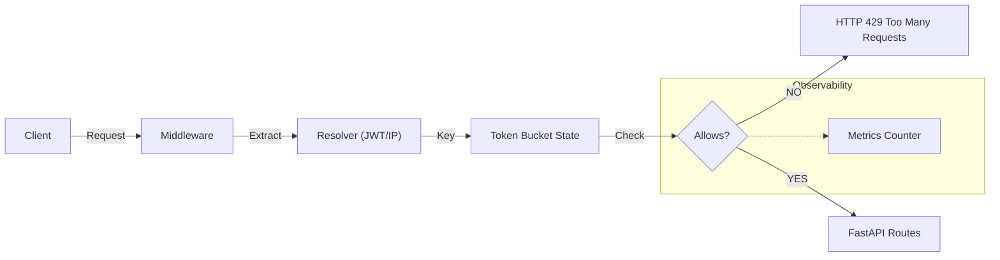

# 🛡️ SentinelRate
**The Infrastructure-Grade Rate Limiter for FastAPI**

> "Rate limiting without identity is blind. Identity without rate limiting is dangerous. Together, they are control."

SentinelRate is a high-performance **Layer 7 Rate Limiting Middleware** designed to protect FastAPI applications from abuse, bursts, and denial-of-service scenarios. Unlike simple decorators, SentinelRate sits at the edge of your application, acting as a decision engine that filters traffic *before* it reaches your business logic.

---

## 🧠 The Philosophy
SentinelRate is built on three core beliefs:
1.  **Identity First**: A rate limiter must know *who* is knocking. Limits for anonymous IPs should be strict; limits for authenticated users should be flexible.
2.  **Stateful, Not Static**: Uses a **Token Bucket** algorithm to allow valid bursts while punishing sustained abuse (simulating real time).
3.  **Zero-Latency Design**: Every microsecond counts. The decision engine is optimized to decide `ALLOW` or `BLOCK` in near-constant time.

---

## ⚡ Key Features

### 1. Dual-Resolution Identity 🕵️‍♂️
Automatically detects the caller's identity and applies dynamic policies:
- **Authenticated Users (JWT)**: `1000 requests/minute` (Configurable)
- **Anonymous Clients (IP)**: `100 requests/minute` (Configurable)

### 2. Token Bucket Engine 💧
Implements a mathematical Token Bucket algorithm that:
- Allows short bursts of traffic (e.g., loading a dashboard).
- Smoothly throttles sustained high-volume requests.
- Uses `time.monotonic()` to be immune to system clock jumps.

### 3. Real-Time Observability 📊
Built-in `/metrics` endpoint exposes live system health:
```json
{
  "allowed": 1042,
  "blocked": 53,
  "total": 1095
}
```

### 4. Enterprise-Grade Headers 📨
Every response includes standard RateLimit headers for frontend integration:
- `X-RateLimit-Limit`: Maximum requests allowed.
- `X-RateLimit-Remaining`: Requests left in the current window.
- `X-RateLimit-Reset`: Unix timestamp when the bucket refills.
- `Retry-After`: Seconds to wait (only on 429 responses).

### 5. Memory Safety (Garbage Collection) 🧹
Includes an automatic "Lazy Cleanup" mechanism that removes stale user buckets after 5 minutes of inactivity, preventing memory leaks during DDoS attacks from random IPs.

---

## 🏗️ Architecture
SentinelRate operates as a middleware pipeline:



---

## � Project Structure
Designed as a modular service, not a script.

```text
SentinelRate/
├── app/
│   ├── limiter/         # The Math (Token Bucket Algorithm + GC)
│   ├── middleware/      # The Gatekeeper (FastAPI Middleware)
│   ├── metrics/         # The Dashboard (Stats Manager)
│   ├── resolver.py      # The Identity Logic (JWT vs IP)
│   ├── config.py        # The Settings (Pydantic)
│   └── main.py          # The Application Entrypoint
├── tests/               # Pytest Suite
└── requirements.txt     # Dependencies
```

---

## �🛠️ Quick Start

### 1. Installation
```bash
git clone https://github.com/shriramrajat/SentinelRate.git
cd SentinelRate
python -m venv venv
# Windows: .\venv\Scripts\Activate
# Mac/Linux: source venv/bin/activate
pip install -r requirements.txt
```

### 2. Configuration (`.env`)
Create a `.env` file (optional, defaults provided in `app/config.py`):
```ini
APP_ENV=production
ANON_LIMIT=100
USER_LIMIT=1000
DEFAULT_PERIOD=60
```

### 3. Run Server
```bash
uvicorn app.main:app --reload
```

### 4. Verify
- **Health Check**: `http://127.0.0.1:8000/health`
- **Metrics Dashboard**: `http://127.0.0.1:8000/metrics`

---

## 🧪 Testing

### Run Unit Tests
```bash
pytest tests/
```

### Run Load Test
We include a script to simulate traffic spikes:
```bash
python test_spam.py
```

---

## ⚠️ Status
**Current Version**: `v1.0.0`
This project is production-ready for single-instance deployments. For distributed setups (Kubernetes), the In-Memory Store should be replaced with Redis.